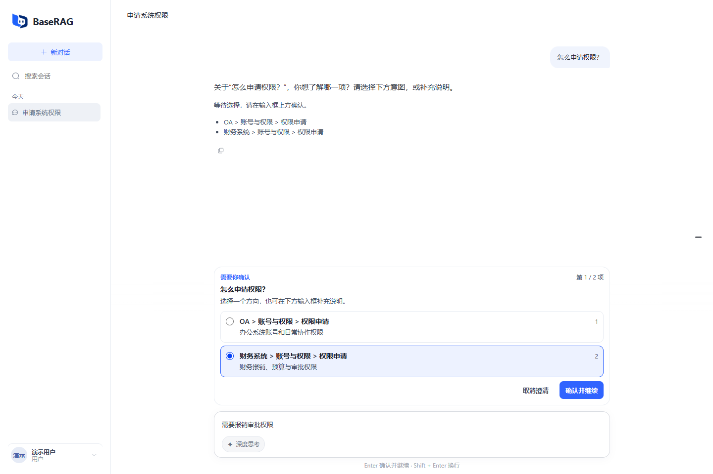
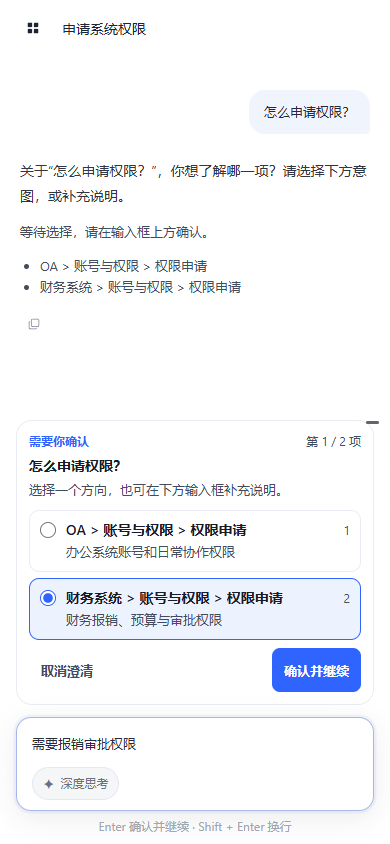

# KB 意图消歧协议

## 执行边界

会话问答在 `RagContextPreparation` 之后、任何检索或工具执行之前运行
`ClarificationDecisionStage`。两个有效 KB 候选都达到路由置信度阈值，且分差小于等于
`rag.pipeline.routing.clarification-score-gap`（默认 `0.10`）时才进行语义确认。
分差使用十进制比较，避免 `0.8 - 0.7` 的浮点误差改变边界。

一次确认覆盖全部接近候选。`NEEDS_CHOICE` 暂停整轮；`EXPLICIT` 应用指定候选；
`BOTH` 和 `UNKNOWN` 保留原路由。确认超时、格式错误或非法 ID 保留原路由并记录
`CLARIFICATION_CONFIRMATION_FAILED`；取消不降级。无会话问答不进入此阶段。

多子问题依原顺序逐项澄清，全部完成才恢复整轮执行。重试和重新生成复用已保存选择。
续接重新读取节点及公共库归属，失效时结束待办并告知用户重新提问，不执行过期目标。
检索保留绑定公共库优先和其他公共库补充的原有预算。

## HTTP 与 SSE

`POST /api/conversations/{id}/messages` 仍使用原 SSE 协议。普通输入不变：

```json
{"clientMessageId":"<UUID>","content":"财务系统"}
```

选择卡片后，点击“确认并继续”提交；仅切换选项不会发起请求。可同时填写补充说明：

```json
{
  "clientMessageId":"<UUID>",
  "clarificationId":"<服务端签发 UUID>",
  "selectedNodeId":"<候选 KB 叶子 UUID>",
  "content":"需要报销审批权限"
}
```

选择正文由服务端候选路径生成，并保留可选补充说明；不选卡片时也可直接提交自由文本。
两个选择字段必须同时提供；会话不存在或不属于本人返回
404，过期澄清、非法选项或认领冲突返回 409 `CLARIFICATION_CONFLICT`。
幂等检查优先于待办校验，相同 `clientMessageId` 重放已有终态，不重复执行。

SSE `complete` 的 `assistantMessage` 新增可空 `clarification`：

```json
{
  "id":"<澄清 UUID>",
  "type":"KB_INTENT",
  "status":"PENDING",
  "question":"怎么申请权限？",
  "currentStep":1,
  "totalSteps":2,
  "options":[{"nodeId":"<KB 叶子 UUID>","label":"财务系统 > 权限申请","description":"报销、预算与审批权限"}]
}
```

追问消息状态为 `COMPLETED`，`sources`、`citations` 为空，不创建最终回答模型尝试。
`GET /api/conversations/{id}` 和 `/turns` 的会话对象提供可空 `pendingClarification`，
与当前分页窗口独立。历史元数据不能作为新提交的授权依据。
多项澄清展示“第 1 / 2 项”，总项数保存在上下文快照中，续接及刷新保持一致。
旧快照缺少问题、说明和进度字段时使用兼容展示；此次交互调整不新增数据库表或迁移。

`DELETE /api/conversations/{id}/clarifications/{clarificationId}` 返回 204。
重复取消已结束记录保持幂等；`RESUMING` 返回 409，需先使用原停止生成接口。
待办期间的文本均为补充，取消之后才能开始新问题。

## 持久化与恢复

V14 新增 `conversation_clarifications` 和消息上的两个可空文本快照字段。
部分唯一索引保证每个会话最多一条 `PENDING`／`RESUMING` 记录。
上下文仅包含原消息 ID、稳定问题计划、待选意图、已选意图和补充消息引用，
不保存工具参数、工具结果或检索结果。

创建补充轮次与 `PENDING → RESUMING` 条件认领同事务完成。终态事务将旧待办置为
`RESOLVED`，必要时建立新的 `PENDING`，同步保存消息及 Trace 后再发送 SSE。
取消待办使用 `CANCELLED`；生成失败或停止释放回 `PENDING`，补充消息保留恢复上下文。
启动恢复沿用项目当前的单实例中断恢复策略，不宣称支持多实例抢占恢复。

禁止重新生成追问；待办期间只允许重试该待办最后一次失败或停止的续接。
完成后的正常回答可以按原有最后轮次规则重新生成，并保留服务端选择约束。

## 观测与验证

Trace 使用 `CLARIFICATION` 阶段、`KB_INTENT_AMBIGUOUS` 原因和
`WAITING_CLARIFICATION` 模式。请求可以为 `COMPLETED`，但不计作问题回答成功；
回答成功率的分子、分母及趋势回答耗时样本排除等待澄清。澄清话术不进入已回答记忆，
续接回答的记忆包含原问题和用户补充。

测试：`ClarificationDecisionStageTest`、`DefaultRagEngineTest`、
`ClarificationIntegrationTest`、`ClarificationChoices.test.ts` 和会话生成 store 测试。
数据库集成测试使用 `RAG_INTEGRATION=true` 及指向独立库的 `TEST_DB_URL`。

以下截图来自真实 Vue 页面、受控接口数据，不代表生产模型评测结果：





MCP 参数澄清不在本次实现范围。


### 本次验收记录（2026-09-27）

- 后端默认测试集：467 项，433 项通过，34 项基础设施测试按环境条件跳过，无失败。
- 独立 PostgreSQL 库另行执行 7 项澄清集成测试，全部通过；验证补充说明和连续澄清进度持久化。
- 前端：31 个测试文件、94 项测试通过；生产构建与 Prettier 检查通过。
- 后端打包和 Spotless 检查通过。浏览器使用受控接口数据验证移动端无横向溢出、刷新、
  候选提交、SSE 完成和历史选项禁用；截图已人工查看。
- 本次未连接生产模型进行准确率评测；模型行为通过受控返回值验证。

澄清操作面板固定在现有输入框上方，补充说明使用同一输入框；点击“确认并继续”或按 Enter
提交当前选择及文字，Shift + Enter 换行。消息区仅展示澄清历史，完成或取消后收起操作面板。
面板从会话待办摘要恢复，与当前历史分页窗口无关。
