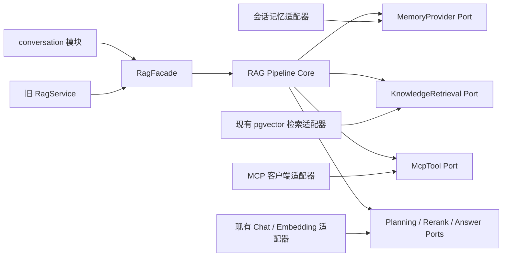

# 阶段 2：RAG 链路模块化优化计划

> 文档状态：方案草案<br>
> 编写日期：2026-09-14<br>
> 适用范围：BaseRAG 后端 RAG 问答链路<br>
> 关联文档：`../REQUIREMENTS.md`、`architecture.md`、`backend-structure.md`、`decisions.md`

## 1. 背景与目标

当前系统已经具备多轮会话、历史摘要、最近对话窗口、问题改写、向量检索、上下文组装、流式回答和引用校验。现有实现仍是一条单查询链路：

```text
历史准备与问题改写 → 单问题向量检索 → 全局 Top K → 提示词 → 模型回答
```

阶段 2 将其升级为可独立演进的模块化 RAG 流水线：

```text
会话记忆
  → 问题重写与子问题拆分
  → 子问题意图识别与路由
  → 分预算执行知识库检索 / MCP 工具 / 系统闲聊
  → 候选合并与去重
  → 模型重排序与预算截取
  → 提示词组装
  → 大模型回答、引用校验与结果持久化
```

本阶段的核心目标如下：

1. 复杂问题可以结合多轮上下文改写，并拆分为数量受限、可独立执行的子问题。
2. 每个子问题被明确路由到知识库检索、MCP 工具调用或系统闲聊，不再强制所有问题走知识库。
3. 每个子问题拥有独立的候选数、耗时和调用预算，避免某个子问题占满全局上下文。
4. 多路结果先合并去重，再用模型重排序，最终在全局证据预算内兼顾相关性与子问题覆盖率。
5. RAG 核心通过稳定接口与会话、知识库、模型和 MCP 隔离，可以单独测试、替换和关闭某个阶段。
6. 保持现有 REST 接口、SSE 事件、前端交互、会话 CRUD、回答版本、停止和重试语义兼容。

## 2. 范围说明

### 2.1 本阶段包含

- 加载持久化历史摘要和最近完成的对话轮次。
- 基于历史上下文生成独立问题，并拆分子问题。
- 对子问题执行知识库、MCP、系统闲聊三类意图识别。
- 多子问题独立检索、独立预算、候选合并和覆盖保护。
- 分块精确去重、近似去重和来源归并。
- 使用模型进行候选重排序，并按全局证据预算截取。
- 面向多类型结果的安全提示词组装。
- 流式生成、引用校验、失败降级、取消传播和可观测性。
- 可重复的离线评测、特性开关和灰度切换。

### 2.2 本阶段不包含

- 修改文档上传、解析、分块或 Embedding 入库流程。
- 修改知识库和文档的现有 REST 接口。
- 通用 Agent 循环、自主规划、多 Agent 或任意代码执行。
- 允许模型调用未登记、未授权的 MCP 工具。
- 直接把互联网内容作为可信知识库证据。
- 为本次重构同时引入消息队列、缓存集群或微服务拆分。
- 因优化 RAG 而改动前端展示协议；内部阶段进度暂不新增 SSE 事件。

当前 `REQUIREMENTS.md` 明确把 MCP、Tool Calling 和 Reranker 列为不支持能力。因此本文是下一阶段的实施提案，不代表当前产品已经支持这些能力。进入开发前需要先批准范围变更，并同步更新需求基线和架构文档。

## 3. 隔离原则与兼容边界

“RAG 模块不受其他模块和代码影响”在本计划中定义为：RAG 核心不依赖外部模块的实体、Mapper、Controller、SSE 类型或厂商 SDK；外部能力全部通过 RAG 自己定义的端口访问。它不应被理解成上线时仓库其他文件绝对零改动，因为当前 `ConversationService` 直接编排历史、检索、上下文和生成，接入新流水线必须进行一次最小接线改造。

### 3.1 必须保持不变的外部契约

- `ConversationController` 的 REST 路径和请求 DTO 不变。
- SSE `schemaVersion=1` 以及 `started`、`delta`、`reset`、`complete`、`cancelled`、`error` 语义不变。
- 停止、断连取消、失败重试、重新生成和回答版本切换行为不变。
- `sources`、`citations`、`modelInfo` 的现有前端响应结构保持兼容；新增内部字段不得成为前端必填项。
- 知识库、文档、模型模块不反向依赖 RAG 的内部阶段类。
- 旧的单轮 `RagService.ask(...)` 保留为兼容入口，并在内部转调新门面。

### 3.2 依赖方向



端口接口和中立数据结构归 RAG 模块所有，适配器可以调用其他模块公开的 Service，但不得直接访问其他模块 Mapper。RAG 核心不得引用 `Message`、`Conversation`、`RetrievalMapper`、`ChatClient` 或具体 MCP SDK 类型。

### 3.3 其他模块影响控制

| 模块 | 允许改动 | 禁止改动 |
| --- | --- | --- |
| conversation | 将原 `generate(...)` 中的 RAG 编排替换为一次 `RagFacade.execute(...)`；提供记忆读取适配器；继续负责 SSE 和消息终态 | 改 REST/SSE 协议、会话 CRUD、回答版本语义 |
| knowledgebase / document | 无业务改动；仅通过已有公开服务或检索端口读取 | 修改上传、分块、版本切换流程 |
| model | 为规划、重排、回答增加用途标识或中立调用端口 | 让模型模块依赖 RAG 业务对象 |
| frontend | 第一阶段无需改动 | 依赖内部子问题、路由或重排结构 |
| database | 优先新增 RAG 自有审计表；不修改既有列含义 | 直接改已有列或破坏历史消息兼容性 |

## 4. 目标架构

### 4.1 推荐包结构

```text
com.hnu.backend.rag
├── api                              # 按 M1 需要创建
│   ├── RagFacade.java
│   ├── RagRequest.java
│   ├── RagResult.java
│   └── RagStreamObserver.java
├── controller                       # HTTP 与本地评测入口
├── dto                              # HTTP 请求
├── vo                               # HTTP/跨模块响应
├── memory                           # 阶段一：会话记忆
│   ├── MemoryStage.java
│   ├── MemoryProvider.java
│   └── RagMemory.java
├── planning                         # 阶段二：重写与拆分
│   ├── QueryPlanningStage.java
│   ├── QueryPlanner.java
│   ├── ChatQueryPlanner.java
│   └── QueryPlan.java
├── routing                          # 阶段三：意图与路由
│   ├── IntentRoutingStage.java
│   ├── IntentClassifier.java
│   ├── ChatIntentClassifier.java
│   └── RoutingPlan.java
├── execution                        # 阶段四：按需创建
│   ├── RagPipeline.java
│   ├── RagExecutionContext.java
│   ├── ExecutionStage.java
│   └── StageBudget.java
├── retrieval                        # 知识检索能力
│   ├── KnowledgeRetriever.java
│   ├── RetrievalService.java
│   ├── RetrievalMapper.java
│   └── EvidenceCandidate.java
├── mcp                              # MCP 注册、校验与执行
│   ├── McpToolGateway.java
│   ├── McpToolRegistry.java
│   ├── McpToolExecutor.java
│   └── ToolObservation.java
├── deduplication                    # 阶段五：按需创建
│   └── DeduplicationStage.java
├── rerank                           # 阶段五：按需创建
│   ├── RerankStage.java
│   └── CandidateReranker.java
├── prompt                           # 阶段六：按需创建
│   └── PromptAssemblyStage.java
├── answer                           # 阶段七：回答与引用
│   ├── AnswerStage.java
│   ├── AnswerGenerator.java
│   ├── RagService.java
│   ├── ContextBuilder.java
│   └── Citations.java
├── trace                            # 审计实现时按需创建
│   └── RagTrace.java
└── support
    └── JsonValues.java
```

包按功能和流水线阶段聚合，每个阶段同时拥有自己的模型、端口和实现，避免同一能力分散在全局 `model`、`port`、`adapter` 和 `service` 中。尚无实际代码的阶段不创建空目录；先通过门面包住现有实现，再按里程碑逐阶段补齐。

### 4.2 核心入口

建议使用单一门面表达完整调用，避免调用方了解各阶段：

```java
public interface RagFacade {
  RagResult execute(
      RagRequest request,
      RagStreamObserver observer,
      CancellationToken cancellationToken);
}
```

`RagRequest` 至少包含：

- `requestId`：贯穿日志和审计。
- `conversationId`、`turnIndex`：加载记忆和关联回答。
- `question`：用户原始问题，必须始终保留。
- `knowledgeBaseIds`：允许检索的知识库范围；本地单用户阶段可为空，但接口提前保留。
- `deadline`：本次流水线总截止时间。
- `mode`：`LEGACY`、`PIPELINE` 或 `SHADOW`，便于灰度。

`RagResult` 继续返回回答、来源、引用和模型信息，并可附加仅供后端审计的 `RagTrace`。调用方不直接读取任何中间 Stage 对象。

## 5. 详细链路设计

### 5.1 阶段一：会话记忆

`MemoryStage` 每次提问通过 `MemoryProvider` 获取：

- 当前持久化结构化摘要及摘要版本。
- 尚未纳入摘要但早于最近窗口的完整轮次。
- 最近 N 个已完成轮次，默认沿用当前配置的 8 轮。
- 当前用户问题和会话标识。

记忆仅用于理解指代、延续目标和用户偏好，不作为回答事实证据，也不能产生引用。只加载已完成且当前生效的 assistant 回答；失败、取消、非激活回答版本不进入记忆。

继续复用现有增量摘要策略：累计 4 个移出最近窗口的完整轮次后更新一次摘要。摘要失败时保留旧摘要游标，并把未摘要原文继续传递给后续阶段，不能丢失上下文。

输出统一的 `RagMemory`，不暴露 conversation 模块的 Entity：

```text
RagMemory
├── summary
├── summaryRevision
├── unsummarizedTurns
├── recentTurns
└── loadedThroughTurn
```

### 5.2 阶段二：问题重写与子问题拆分

`QueryPlanningStage` 将历史记忆和当前问题交给规划模型，一次输出结构化 `QueryPlan`：

```json
{
  "standaloneQuestion": "可脱离历史理解的完整问题",
  "subQuestions": [
    {
      "id": "Q1",
      "question": "原子子问题"
    }
  ]
}
```

约束：

- 子问题数量由 `maxSubQuestions` 限制，建议初始值为 4，最终值由评测确定。
- 简单问题、比较问题、汇总问题和需要前序答案的多跳问题保持一个子问题，禁止为了形式而拆分。
- 只有多个目标能够互不依赖地分别检索时才拆分；每个子问题必须语义完整、互不重复，并能映射回用户原始目标。
- 第一版不输出 `dependsOn`，也不执行有依赖的递归 Agent 计划；模型返回依赖或其他额外字段时按原问题整体回答。
- 模型只输出结构化结果，不要求也不保存思维链；可以保存简短、枚举化的决策代码。
- JSON 解析、字段、长度、数量和 ID 必须校验。

降级策略：模型超时、返回非法 JSON、空问题或过度拆分时，使用用户原问题作为 `standaloneQuestion` 和唯一的 `Q1`，继续执行链路。

### 5.3 阶段三：意图识别与路由

`IntentRoutingStage` 对每个子问题独立分类：

| 意图 | 适用场景 | 执行动作 |
| --- | --- | --- |
| `KNOWLEDGE_RETRIEVAL` | 需要从用户知识库查找事实、制度、文档内容 | 调用知识检索端口 |
| `MCP_TOOL` | 需要实时数据、外部系统读取或受控操作 | 在白名单中选择并调用 MCP 工具 |
| `SYSTEM_CHAT` | 问候、能力说明、无需外部事实的一般交流 | 不检索，不调用工具，由回答模型处理 |

分类结果建议包含 `intent`、`confidence`、`toolHint` 和枚举化 `reasonCode`。低置信度不应直接触发有副作用的工具：

- 知识检索与闲聊不确定时优先知识检索，但允许最终因证据不足拒答。
- MCP 与其他意图不确定时，只有只读工具可按白名单自动调用；写操作必须在后续产品方案中定义显式确认协议，本阶段默认禁用。
- 模型建议的工具名、参数和返回文本都按不可信输入处理，必须经过服务端注册表、JSON Schema、大小和超时校验。
- 一个子问题首期只选择一个主意图；确实需要“先工具、再检索”的复杂链路留到后续显式工作流设计。

### 5.4 阶段四：分预算执行与检索合并

每个子问题创建独立 `StageBudget`，至少限制：

- 最大候选分块数。
- 最大 Embedding / 模型调用次数。
- 最大 MCP 工具调用次数。
- 单子问题超时。
- 可进入全局合并池的最大候选数。

同时设置全局预算：

- 最大子问题数。
- 最大模型调用总数。
- 最大 MCP 调用总数。
- 最大合并候选数。
- 最大重排输入数。
- 最大最终证据分块数和上下文字符或估算 Token 数。
- 整条链路截止时间。

知识库子问题分别检索，禁止先把多个问题拼成一个向量。每个候选必须保留以下来源信息：

```text
candidateId / chunkId
sourceSubQuestionIds
knowledgeBaseId / documentId / versionId
embeddingModel
rawSimilarity
retrievalRank
retrievalChannel
content / heading / line range
```

不同 Embedding 模型的相似度不假定可直接比较。合并优先使用基于名次的归一化分数或 RRF；原始相似度仅用于同模型内部排序和审计，不能解释为正确概率。

建议的合并规则：

1. 每个知识库子问题在自身预算内取候选。
2. 先为每个有有效结果的子问题预留最低覆盖名额。
3. 其余名额按归一化合并分数填充到全局候选池。
4. 超出全局候选预算后截断，但保留候选与全部命中子问题的映射。
5. 子问题可以受控并行执行，线程数由配置限制；总取消信号和截止时间必须传播到每个任务。

MCP 子问题执行后生成 `ToolObservation`，记录工具、参数摘要、状态、耗时、结果截断信息和可审计来源。系统闲聊子问题只生成路由记录，不伪造证据。

### 5.5 阶段五：去重与模型重排序

去重必须在模型重排前完成，避免把重排预算浪费在相同或高度重叠的分块上。

去重顺序：

1. `chunkId` 相同：精确去重。
2. 规范化正文哈希相同：跨版本或跨文档内容去重。
3. 同文档相邻分块且正文高度重叠：使用确定性的字符或词集合重叠率去重，首期不为去重额外调用 Embedding。
4. 保留综合检索分最高的候选，将被合并候选的子问题 ID、来源位置和检索分记录到保留项中。
5. 不同文档即使内容相似，也需保留来源归并信息，避免审计时丢失证据出处。

`CandidateReranker` 接收原问题、独立问题、子问题列表和去重后的候选，返回：

```json
{
  "rankedCandidates": [
    {
      "candidateId": "...",
      "relevanceScore": 0,
      "coveredSubQuestionIds": ["Q1"],
      "reasonCode": "DIRECT_EVIDENCE"
    }
  ]
}
```

重排约束：

- 模型只能对输入候选排序，不能新增候选、修改正文或编造来源。
- 输出候选 ID 必须校验，重复和未知 ID 直接丢弃。
- 候选较多时分批重排，再进行一次轻量合并；批大小和最大调用数受全局预算限制。
- 最终截取同时考虑模型相关性、子问题覆盖、知识库范围和上下文预算，而不是机械取重排 Top K。
- 重排模型失败时，降级到确定性的合并分数排序，并在 trace 中标记 `RERANK_DEGRADED`。
- 第一版复用已有 Chat 模型的非流式结构化调用，不立即增加框架依赖；端口保留未来替换专用 Cross-Encoder Reranker 的能力。

### 5.6 阶段六：提示词组装

`PromptAssemblyStage` 负责生成结构稳定、边界清晰的模型输入。建议分为四个数据区：

1. `conversationMemory`：只帮助理解指代和延续上下文，明确声明不是可引用证据。
2. `questionPlan`：原始问题、独立问题、子问题和路由结果。
3. `knowledgeEvidence`：重排后选中的知识库片段，分配稳定的 `S1...Sn` 引用编号。
4. `toolObservations`：MCP 只读工具结果，使用独立的 `T1...Tn` 编号并标记工具、时间和可信边界。

所有文档正文、历史消息、工具结果和模型规划输出都是不可信数据，不得覆盖系统指令。提示词必须明确：

- 知识库事实只能引用本轮 `S*`。
- 工具事实只能引用本轮 `T*`；若现有前端暂不支持工具引用，第一里程碑可在正文标明工具来源并只把 `S*` 放入现有 citations 字段。
- 历史回答不得作为本轮事实证据。
- 多来源冲突时说明冲突，不静默选择。
- 证据不足时明确拒答，不用常识补全知识库问题。
- 系统闲聊可以自然回答，但不得声称调用过未执行的检索或工具。

上下文构建必须采用统一预算器；至少按最大分块数和最大字符数双重限制，并预留系统指令、问题、工具结果和回答所需空间。后续若模型端提供可靠 tokenizer，再把字符估算替换为模型级 Token 计算。

### 5.7 阶段七：大模型回答

`AnswerStage` 只负责最终生成，不再承担检索和路由决策：

- 复用现有流式输出和模型候选回退机制。
- 每个 delta 继续通过 `RagStreamObserver` 映射到现有 SSE `delta`。
- 取消信号应在记忆、规划、分类、检索、工具、重排和生成每个边界检查；取消后不得继续发起新调用。
- 对 `S*` 和未来的 `T*` 分别校验引用，非法引用最多执行一次修复。
- 引用修复只复用原始问题和本轮已选证据，不把错误回答作为新的不可信提示内容。
- 最终返回实际进入提示词的 sources，而不是检索阶段所有候选。
- 生成失败不能覆盖已经持久化的旧回答版本，沿用现有终态和生成尝试记录。

## 6. 预算模型

不要把预算散落为各 Service 中的常量。新增集中配置并在一次执行开始时生成不可变的 `RagBudgetSnapshot`，确保日志、评测和重试可复现。

建议配置结构如下，数值仅作为本地评测起点，不直接作为上线验收值：

```yaml
rag:
  pipeline:
    enabled: false
    shadow-enabled: false
    max-sub-questions: 4
    total-timeout-ms: 45000
    planning-timeout-ms: 5000
    routing-timeout-ms: 5000
    per-question:
      retrieval-candidates: 12
      merge-candidates: 8
      timeout-ms: 8000
      max-tool-calls: 1
    merge:
      max-candidates: 40
      min-coverage-per-question: 1
    deduplication:
      overlap-threshold: 0.85
    rerank:
      enabled: true
      max-input-candidates: 24
      max-model-calls: 2
      selected-evidence: 8
      timeout-ms: 8000
    prompt:
      max-evidence-chars: 16000
      max-tool-result-chars: 6000
```

预算优先级从高到低：安全与授权约束、总截止时间、全局调用上限、子问题最低覆盖、重排相关性。任何阶段不得为了追求完整结果突破更高优先级预算。

## 7. 失败处理与降级矩阵

| 失败点 | 降级行为 | 是否继续回答 |
| --- | --- | --- |
| 历史摘要更新失败 | 使用旧摘要和未摘要原文 | 是 |
| 问题规划失败 | 原问题作为唯一子问题 | 是 |
| 意图识别失败 | 默认路由为知识库检索 | 是 |
| 单个知识检索失败 | 标记该子问题失败，保留其他子问题结果 | 视剩余证据而定 |
| MCP 不可用或超时 | 不伪造结果，明确该子问题暂时无法完成 | 是 |
| MCP 参数不合法或工具未授权 | 拒绝调用并记录稳定错误码 | 是 |
| 去重异常 | 回退精确 `chunkId` 去重 | 是 |
| 重排失败 | 使用合并分数和覆盖规则排序 | 是 |
| 无有效知识证据 | 对知识型问题明确资料不足 | 是 |
| 最终模型失败 | 沿用现有 provider fallback；全部失败进入错误终态 | 否 |
| 引用连续非法 | 进入 `INVALID_CITATIONS` 错误终态 | 否 |
| 用户取消或断连 | 传播取消，不再启动后续阶段 | 否 |

部分子问题失败时，最终回答必须明确哪些部分没有完成，不能用其他子问题的结果猜测补齐。

## 8. 安全设计

- 提示词注入边界：历史、文档、工具描述、工具返回和模型中间输出统一按数据处理。
- 工具注册表：服务端维护允许的 MCP server、tool、版本、只读属性、参数 Schema、超时、输出上限和敏感字段掩码。
- 工具最小权限：本阶段自动执行只读工具；写操作默认禁止，不以模型判断替代用户确认。
- 知识库范围：检索端口只接收调用方已经授权的知识库 ID；未来加入多用户后必须由服务端计算范围。
- 数据泄露控制：日志不记录完整会话、文档正文、工具原始返回、密钥或认证头。
- 输出限制：工具结果和候选正文在进入模型前截断，避免上下文耗尽和恶意超长返回。
- SSRF 与命令执行：RAG 不接受模型任意构造 URL、命令或工具地址，只调用配置注册的 MCP 能力。

## 9. 持久化与可观测性

### 9.1 兼容持久化

现有 `messages.retrieval_query` 暂时保存 `standaloneQuestion`，`messages.sources` 仍只保存最终进入回答提示词的来源快照。这样历史页面和当前 VO 无需变化。

如需完整审计，新增 RAG 自有表而不是修改既有列含义：

```text
rag_runs
├── id / request_id / conversation_id / assistant_message_id
├── mode / status / degraded_flags
├── original_question / standalone_question
├── plan_json / budget_snapshot_json / timing_json
└── created_at / completed_at

rag_stage_runs
├── id / rag_run_id / stage / sub_question_id
├── status / input_count / output_count
├── model_info_json / error_code / duration_ms
└── detail_json
```

为保持 RAG 独立，`conversation_id` 和 `assistant_message_id` 仅作为关联 UUID，不建立指向 conversation 表的强外键。正文、完整工具返回和敏感参数不写入 trace。若本地 MVP 暂不需要逐阶段审计，可先仅记录结构化日志，不阻塞主链路上线。

### 9.2 指标与日志

每次执行至少记录：

- `requestId`、`ragRunId`、模式、最终状态和降级标记。
- 记忆轮次数、摘要版本、子问题数和各意图数量。
- 每个子问题候选数、检索模型数、工具调用数和耗时。
- 合并前后、去重前后、重排输入和最终证据数量。
- 规划、路由、Embedding、检索、工具、重排、首 Token、生成和总耗时。
- 各用途模型、调用次数、Token 用量和估算费用（服务商提供时）。
- 引用数、引用修复次数、拒答和取消状态。

日志只记录 ID、数量、枚举、耗时和内容哈希，不记录完整正文。

## 10. 测试与评测计划

### 10.1 单元测试

- `MemoryStageTest`：摘要游标、最近窗口、失败和取消轮次过滤。
- `QueryPlanningStageTest`：简单问题不拆分、复杂问题拆分、非法 JSON、超量子问题降级。
- `IntentRoutingStageTest`：三类意图、低置信度策略、未授权工具拒绝。
- `ExecutionStageTest`：每子问题预算、并发上限、超时和取消传播。
- `CandidateMergeTest`：跨 Embedding 模型名次归一化、最低覆盖、公平截断。
- `DeduplicationStageTest`：chunk ID、正文哈希、相邻重叠和来源归并。
- `RerankStageTest`：未知 ID、重复 ID、分批重排和失败降级。
- `PromptAssemblyStageTest`：预算截断、稳定引用编号、不可信数据边界。
- `AnswerStageTest`：流式、provider fallback、引用修复和取消。

### 10.2 契约与集成测试

- 为 `MemoryProvider`、`KnowledgeRetriever`、`McpToolGateway` 和模型端口建立契约测试。
- 使用假模型服务器固定规划、分类、重排和回答输出，避免日常测试依赖真实模型。
- 使用假 MCP server 覆盖成功、超时、Schema 错误、超长输出和未授权工具。
- PostgreSQL/pgvector 集成测试验证多子问题检索、跨模型合并和 READY 版本限制。
- 现有会话 SSE、停止、重试、重新生成、来源快照和单轮兼容测试必须全部保留。

### 10.3 离线评测集

在现有评测题之外增加四组标注：

1. 上下文依赖题：代词、省略、否定、时间和实体延续。
2. 多跳或多主题题：带期望子问题和必要证据集合。
3. 路由题：知识库、MCP、闲聊，以及易混淆边界题。
4. 对抗题：提示词注入、虚假工具名、恶意文档和超长工具返回。

指标至少包含：

- 独立问题语义保持率、必要实体和约束保留率。
- 子问题覆盖率、过度拆分率和重复率。
- 意图识别 Macro-F1、MCP 未授权调用数。
- 每子问题 Recall@K、合并后必要证据覆盖率。
- 去重率及去重后的证据丢失率。
- 重排 nDCG@K 或 MRR、最终证据 Precision@K。
- 回答正确率、引用支持率、拒答准确率和部分失败说明准确率。
- P50/P95 各阶段延迟、首 Token 延迟、总调用次数和单题成本。

### 10.4 上线门槛

- 旧单问题评测质量不得低于当前基线。
- 多子问题必要证据覆盖率相对旧链路有可测量提升。
- 知识库 / MCP / 闲聊三类路由达到评审后冻结的 Macro-F1 门槛。
- 未授权或写型 MCP 工具自动调用数必须为 0。
- 重排开启后答案或证据指标有稳定收益，否则保留端口但默认关闭。
- P95 延迟和单题费用不得超过在 M0 冻结的上限。
- 现有后端测试、前端测试和构建全部通过。

## 11. 分阶段实施计划

### M0：基线冻结与契约确认

- 固定当前模型、Top K、评测集、质量、延迟和费用基线。
- 冻结现有 REST、SSE、消息状态、sources 和 citations 契约。
- 确认 MCP 仅允许只读白名单工具，并批准需求范围变更。

退出条件：能够重复生成旧链路基线报告，需求和接口边界完成评审。

### M1：RAG 门面、端口与兼容适配

- 建立 `RagFacade`、执行上下文、预算快照、取消令牌和 trace。
- 用现有单问题链路实现 `LEGACY` 模式，结果与现状一致。
- `ConversationService` 只做一次接线改造，把内部 RAG 编排替换为门面调用。

退出条件：特性关闭时行为和当前版本一致，所有现有回归测试通过。

### M2：记忆、重写与拆分

- 把现有 `ConversationContextService` 能力适配为 `MemoryProvider`。
- 增加结构化问题规划、校验、最大子问题数和单问题降级。
- 持久化或记录 `standaloneQuestion`、子问题数和规划耗时。

退出条件：上下文依赖题不退化，规划失败可以稳定回退原问题。

### M3：意图识别与 MCP 只读路由

- 实现三类意图和低置信度策略。
- 建立 MCP 工具注册表、Schema 校验、超时、输出截断和敏感字段掩码。
- MCP 默认通过独立特性开关关闭，先使用假服务完成集成测试。

退出条件：路由评测达标，未授权和写型工具均不可自动执行。

### M4：多子问题检索、预算与合并

- 每个知识型子问题独立生成向量和检索。
- 引入不可变预算快照、受控并发、RRF 或名次归一化合并和最低覆盖。
- 保留候选到子问题的完整溯源。

退出条件：多问题必要证据覆盖率提升，超时和取消可以中止所有未开始工作。

### M5：去重与模型重排

- 实现确定性三级去重和来源归并。
- 实现结构化模型重排、输出校验、批处理和确定性降级。
- 用评测决定默认重排输入数和最终证据预算。

退出条件：重排相对合并基线有稳定净收益，失败时不影响回答可用性。

### M6：统一提示词、回答与审计

- 统一 memory、plan、knowledge evidence 和 tool observation 数据区。
- 接入现有流式回答、引用验证、修复、消息终态和来源快照。
- 完成阶段指标、结构化日志和可选 RAG 审计表。

退出条件：端到端功能、引用、安全、取消、重试和恢复测试通过。

### M7：Shadow、灰度与收口

- `SHADOW` 模式只运行到证据选择，不调用第二次最终回答，并与旧链路比较候选质量。
- 在本地或内部环境按配置启用新链路，保留一键回退 `LEGACY`。
- 达到质量、延迟、成本和安全门槛后再把 `PIPELINE` 设为默认。
- 同步更新 `REQUIREMENTS.md`、`architecture.md`、`decisions.md` 和运维说明。

退出条件：连续评测和内部使用无阻断回归，旧链路仅作为短期回滚路径保留。

## 12. 交付物

- RAG 门面、流水线阶段、领域模型、端口和适配器代码。
- 新增配置项、配置校验和安全默认值。
- MCP 只读工具注册与假服务测试夹具。
- 单元、契约、集成、SSE 回归和安全测试。
- 扩展后的离线评测集、基线报告和新旧对比报告。
- RAG 阶段指标、结构化日志和可选审计迁移。
- 更新后的需求、架构、决策和部署文档。

## 13. 主要风险与控制措施

| 风险 | 影响 | 控制措施 |
| --- | --- | --- |
| 模型拆分不稳定或过度拆分 | 调用数、延迟和噪声上升 | 最大子问题数、结构校验、简单问题不拆分、失败回退 |
| 意图误判导致错误工具调用 | 数据或外部系统风险 | 只读白名单、低置信度不执行副作用、服务端 Schema 与权限校验 |
| 子问题竞争全局预算 | 某些问题无证据 | 独立预算、最低覆盖、全局上限和可审计截断 |
| 跨 Embedding 分数不可比 | 合并排序失真 | 使用名次归一化或 RRF，原始分数只在同模型内比较 |
| 去重误删必要证据 | 答案覆盖下降 | 分级去重、保留来源映射、以证据丢失率评测 |
| LLM 重排延迟和费用过高 | 首 Token 变慢、成本上升 | 输入上限、批次上限、专用开关、确定性降级、收益门槛 |
| 多次模型调用扩大故障面 | 可用性下降 | 每阶段超时、总截止时间、降级矩阵、取消传播 |
| 新链路侵入会话代码 | 回归停止、重试和 SSE | 单门面接线、兼容适配、契约测试、Shadow 和一键回滚 |
| 中间结果包含敏感内容 | 日志或审计泄露 | 只记元数据、哈希和枚举；正文与敏感参数不落 trace |

## 14. 完成定义

本阶段只有在以下条件全部满足时才视为完成：

1. 七个阶段均可独立单测，并可通过端口替换外部依赖。
2. RAG 核心不引用其他业务模块的 Controller、Mapper、Entity 或传输协议类型。
3. 除 conversation 的一次门面接线和必要适配器外，不要求其他业务模块理解 RAG 内部流程。
4. 现有 REST、SSE、停止、重试、重新生成、来源展示和历史恢复无回归。
5. 多子问题、三类路由、独立预算、去重和模型重排通过离线评测与安全测试。
6. 新链路可通过配置关闭，并能在不迁移历史消息的情况下回退旧链路。
7. 质量提升、P95 延迟、调用成本和降级率均有可复现报告，而不是只凭主观样例判断。
