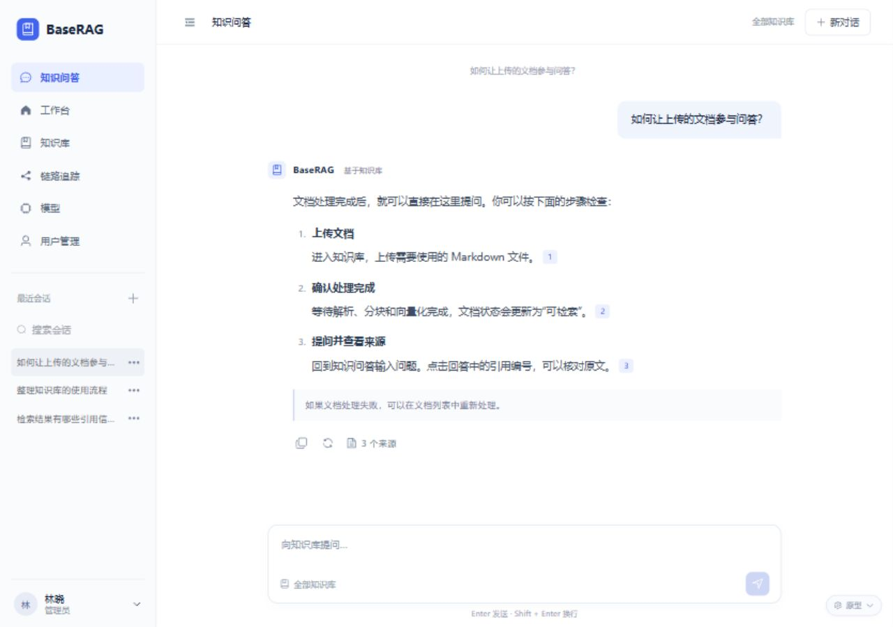
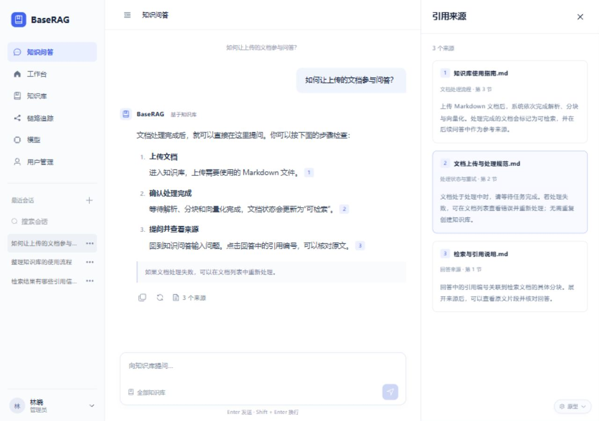
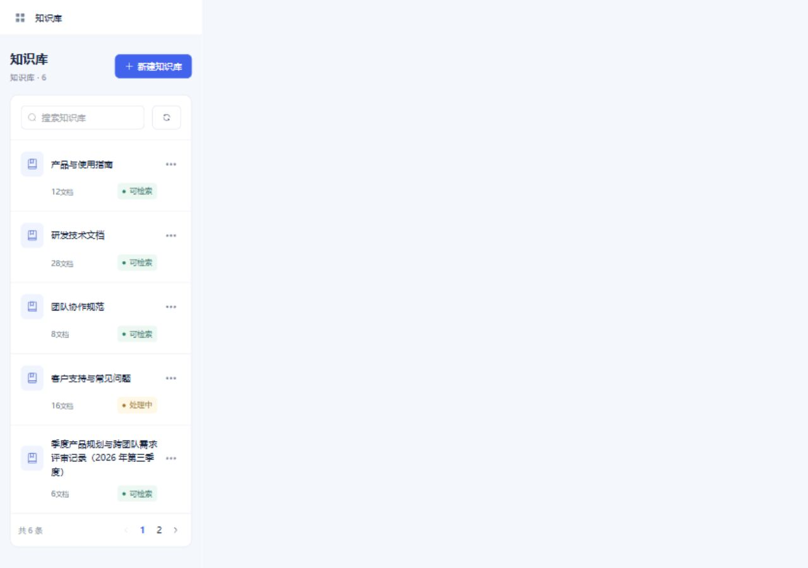
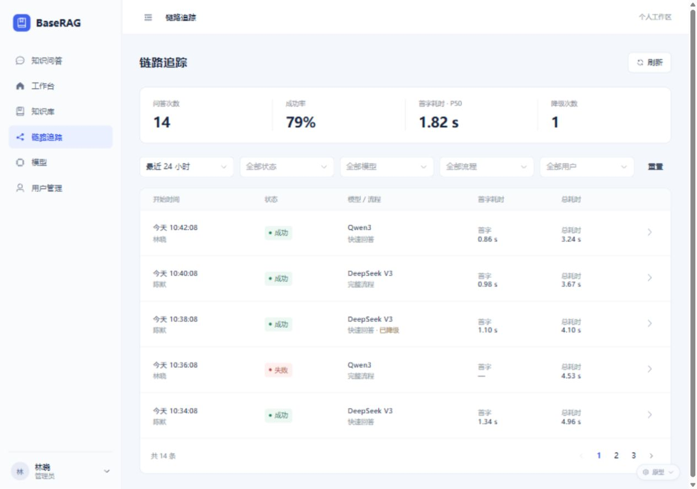
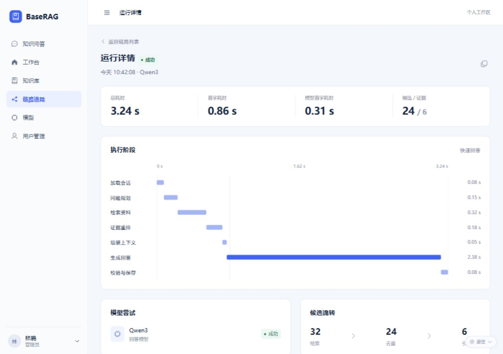
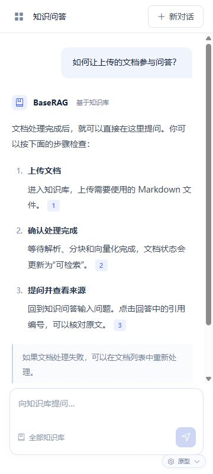
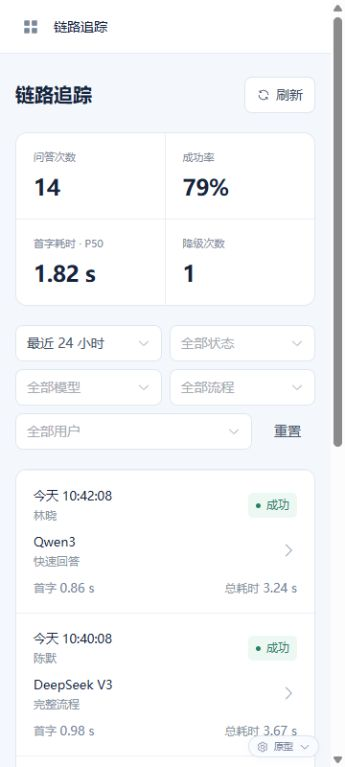
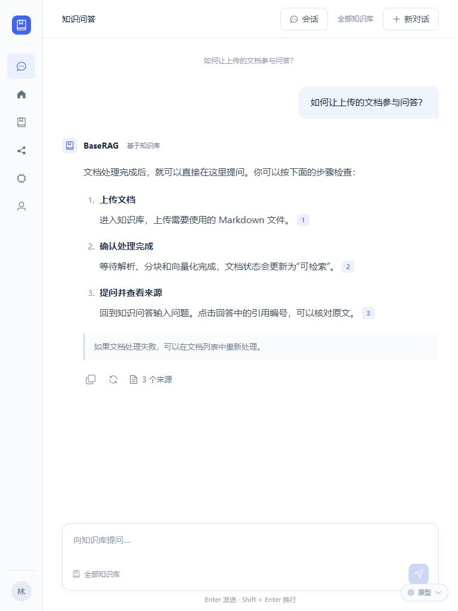

# BaseRAG 前端原型

独立的全站可点击原型。使用系统默认无衬线字体、统一浅色导航、蓝色操作按钮和紧凑管理列表。来源编号与选中原文对应，链路详情用阶段时间轴表达耗时。

## 打开

在 `frontend` 目录执行：

```powershell
npm run dev -- --host 127.0.0.1 --port 5175
```

打开 [界面原型](http://127.0.0.1:5175/prototype.html)。正常应用入口仍为 `/`；原型入口不导入业务路由、认证 store 或 API 客户端，正式应用导航不提供原型入口。

## 独立构建与预览

在 `frontend` 目录执行：

| 用途 | 构建 | 预览 | 产物入口 |
| --- | --- | --- | --- |
| 正式应用 | `npm run build` | `npm run preview` | `dist/index.html` |
| 界面原型 | `npm run build:prototype` | `npm run preview:prototype` | `dist-prototype/prototype.html` |

原型预览启动后，在终端显示的本地地址后加 `/prototype.html`。默认生产构建不包含原型页面或原型脚本，两个构建目录互不覆盖。发布正式应用时只使用 `dist/`；`dist/` 和 `dist-prototype/` 均已加入 Git 忽略规则，不提交生成产物。

所有数据与操作均为浏览器内存中的演示，刷新后重置；文件上传仅读取文件名，不读取或上传文件内容。登录接受非空示例用户名和密码，不验证真实账号。密码弹窗只演示校验和反馈，不保存密码。

## 审阅路径

1. 知识问答：输入问题并发送，停止生成后重试，重新生成完成后切换回答版本；点击编号核对来源。会话列表支持搜索、新建、重命名和删除。
2. 知识库：创建知识库，进入文档再进入分块；尝试搜索、分页、重命名、删除、上传 `.md` 文件和失败文档重试。上传与重试显示“处理中”，不运行真实处理任务。
3. 链路追踪：按状态、模型、流程和用户筛选，进入成功、失败、降级、取消和生成中的记录；展开技术信息。时间筛选使用固定示例数据，最近 1 小时演示为最近 5 条。
4. 用户管理：创建示例用户，重置密码、启禁用。当前管理员的个人密码操作位于账号菜单。
5. 右下角“原型”：切换管理员/普通用户、正常/加载/空/错误状态、查看登录页及模拟生成失败。普通用户隐藏用户管理和用户筛选，并只展示本人的链路记录。
6. 模型页保持“未接入”的只读状态，工作台提供快捷入口与最近活动。

## 布局与实现边界

- 1280px：224px 浅色侧栏，聊天正文最大 800px，来源面板打开后正文让出空间。
- 768px：图标导航，聊天顶部“会话”打开历史列表，来源以抽屉展示。
- 360px：菜单抽屉、卡片列表、两列指标和换行筛选，输入框保持可访问。
- 弹窗使用组件库的焦点管理；移动导航支持 Escape 关闭、Tab 循环及焦点返回。关闭的移动导航不参与键盘访问。尊重减少动效设置。
- 正式业务界面已按原型接入，保留原有认证、SSE 和真实业务流程；原型继续独立保存，不作为功能契约。正式界面创建知识库必须选择真实向量模型，文档上传后需要手动分块。未新增依赖、后端接口或数据库变更。

## 正式界面验证（2026-09-15）

正式入口为 [应用](http://127.0.0.1:5175/)。已统一导航、聊天与来源、知识库/文档/分块、工作台、链路追踪、登录与账号页面；用户管理调用已有后端接口，并通过路由和菜单限制管理员访问。模型页仍为只读未接入状态。

- 创建知识库提交所选向量模型 ID；上传仅上传，分块/重新分块仍由用户手动触发。保留文件类型、大小限制和重新分块确认。
- 自动化验证：前端 24 项测试通过，格式检查与生产构建通过；后端 155 项测试中 144 项通过、11 项按配置跳过，Spotless 和打包通过。未启用基础设施集成测试。
- 浏览器使用现有登录账号检查真实知识库、文档、运行详情、长回答与多条引用；未创建/删除真实资源，也未执行密码变更。发送、停止、重试和版本行为由已有自动化测试覆盖，未重新调用真实模型生成。
- 正式页面的真实数据截图仅在本地留存，不纳入原型提交；下方提交的截图使用原型模拟数据。

## 验证

原型新增 4 项回归用例覆盖停止与重试、回答版本、普通用户的观测范围、文档/分块分页及来源定位。前端共 20 项测试通过，格式检查和生产构建通过；后端共 155 项测试，144 项通过、11 项按配置跳过，Spotless 与打包通过（基础设施测试未启用）。

截图在 `screenshots` 目录，包含桌面聊天、来源、知识库、链路列表与详情，以及移动端和平板核心页面。

## 核心页面截图

### 桌面聊天与引用





### 知识库与链路







### 移动端

| 聊天 | 知识库 | 链路追踪 |
| --- | --- | --- |
|  |  |  |

### 平板



其他截图： [工作台](screenshots/dashboard-desktop.png)、[用户管理](screenshots/users-desktop.png)、[创建用户](screenshots/create-user-desktop.png)、[登录](screenshots/login-desktop.png)、[模型](screenshots/models-desktop.png)。
